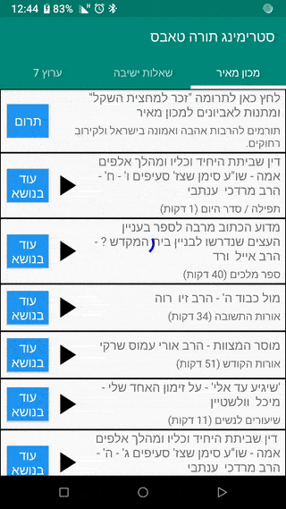
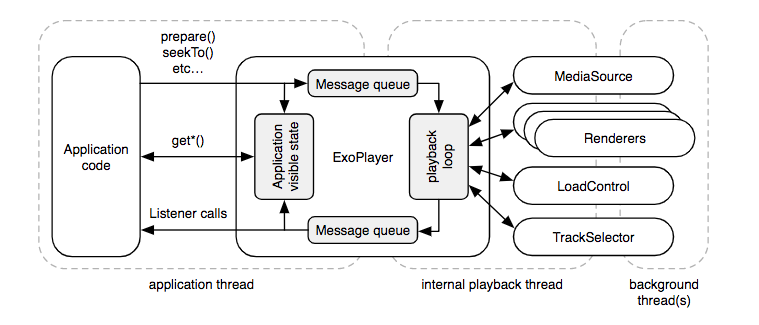

# Streaming Tora Tabs

MVVM - LiveData

Kotlin

RXJava

mp3 service implementation with binding

volley network

dynamic tabs

Rss XML parser

dynamic notification - play & pause from foreground service notification (even if activity been killed)

ExoPlayer - jump to desire track position

orientaion change handling (without unnecessary network operation)

GC friendly - tested with "com.squareup.leakcanary"

 
